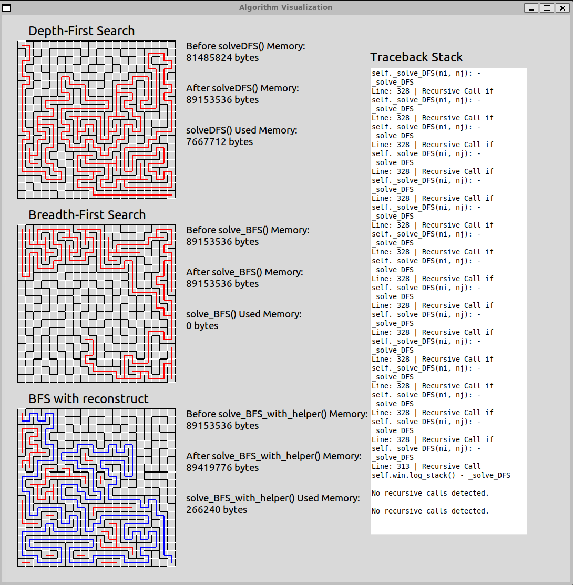

# Algorithm Visualization Maze Solver 

## Overview
Welcome to my **Algorithm Visualization Maze Solver**! This project visually demonstrates **Depth-First Search (DFS) vs. Breadth-First Search (BFS)**, providing insights into **pathfinding efficiency, recursion, and memory usage** in real time.

##  Features
-  **DFS vs. BFS Comparison** – Watch how each algorithm explores the maze , DFS is implemented with recursion and BFS implemented with queue
-  **Memory Usage Tracking** – View real-time memory consumption per maze , psutil used to help demonstrate the memory usage differences
-  **BFS Reconstruction** – Optimized path reconstruction for better solutions
-  **Interactive UI** – Built using Tkinter for a smooth visualization experience  

